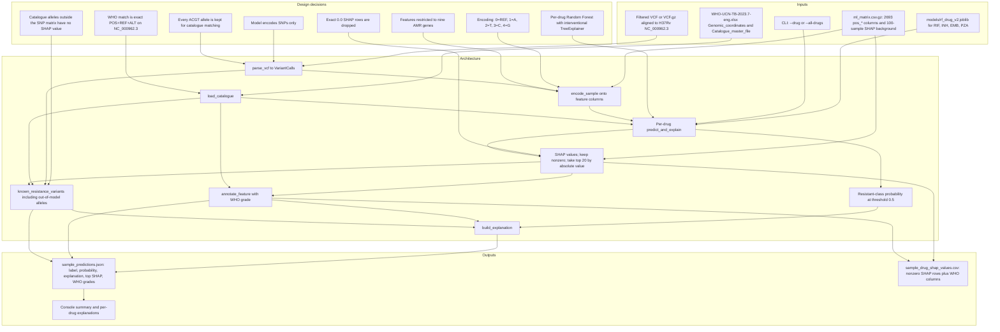

# Architecture of `vcf_to_prediction.py`

Inputs, design decisions, processing stages, and outputs of the isolate-level resistance prediction script.

```mermaid
flowchart TB
    subgraph inputs [Inputs]
        vcf["Filtered VCF or VCF.gz aligned to H37Rv NC_000962.3"]
        matrix["ml_matrix.csv.gz: 2693 pos_* columns and 100-sample SHAP background"]
        models["models/rf_drug_v2.joblib for RIF, INH, EMB, PZA"]
        catalogue["WHO-UCN-TB-2023.7-eng.xlsx Genomic_coordinates and Catalogue_master_file"]
        cli["CLI: --drug or --all-drugs"]
    end

    subgraph decisions [Design decisions]
        snpModel["Model encodes SNPs only"]
        allAlleles["Every ACGT allele is kept for catalogue matching"]
        encoding["Encoding: 0=REF, 1=A, 2=T, 3=C, 4=G"]
        nineGenes["Features restricted to nine AMR genes"]
        rfShap["Per-drug Random Forest with interventional TreeExplainer"]
        whoMatch["WHO match is exact POS+REF+ALT on NC_000962.3"]
        dropZero["Exact 0.0 SHAP rows are dropped"]
        outOfModel["Catalogue alleles outside the SNP matrix have no SHAP value"]
    end

    subgraph architecture [Architecture]
        parseVcf["parse_vcf to VariantCalls"]
        encodeSample["encode_sample onto feature columns"]
        loadCatalogue["load_catalogue"]
        predictLoop["Per-drug predict_and_explain"]
        predictProb["Resistant-class probability at threshold 0.5"]
        shapValues["SHAP values; keep nonzero; take top 20 by absolute value"]
        annotateFeat["annotate_feature with WHO grade"]
        knownVars["known_resistance_variants including out-of-model alleles"]
        buildExpl["build_explanation"]
    end

    subgraph outputs [Outputs]
        predJson["sample_predictions.json: label, probability, explanation, top SHAP, WHO grades"]
        shapCsv["sample_drug_shap_values.csv: nonzero SHAP rows plus WHO columns"]
        consoleOut["Console summary and per-drug explanations"]
    end

    vcf --> parseVcf
    matrix --> encodeSample
    matrix --> shapValues
    models --> predictLoop
    catalogue --> loadCatalogue
    cli --> predictLoop

    snpModel --> parseVcf
    allAlleles --> parseVcf
    encoding --> encodeSample
    nineGenes --> encodeSample
    rfShap --> predictLoop
    whoMatch --> loadCatalogue
    dropZero --> shapValues
    outOfModel --> knownVars

    parseVcf --> encodeSample
    encodeSample --> predictLoop
    loadCatalogue --> predictLoop
    predictLoop --> predictProb
    predictLoop --> shapValues
    shapValues --> annotateFeat
    loadCatalogue --> annotateFeat
    parseVcf --> knownVars
    loadCatalogue --> knownVars
    shapValues --> knownVars
    predictProb --> buildExpl
    annotateFeat --> buildExpl
    knownVars --> buildExpl

    buildExpl --> predJson
    annotateFeat --> predJson
    knownVars --> predJson
    shapValues --> shapCsv
    annotateFeat --> shapCsv
    predJson --> consoleOut
```
